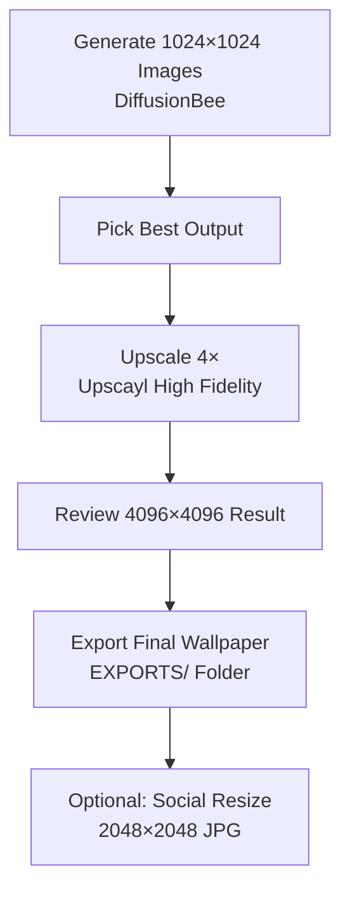
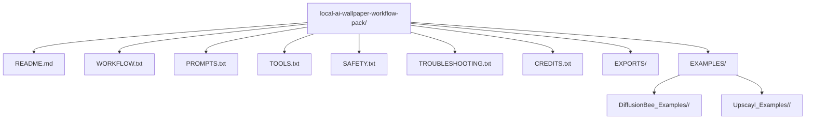
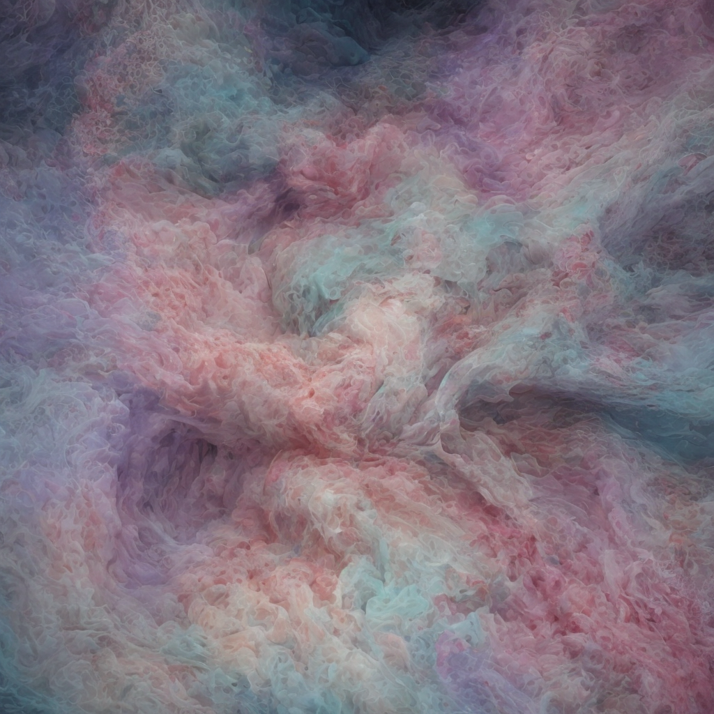
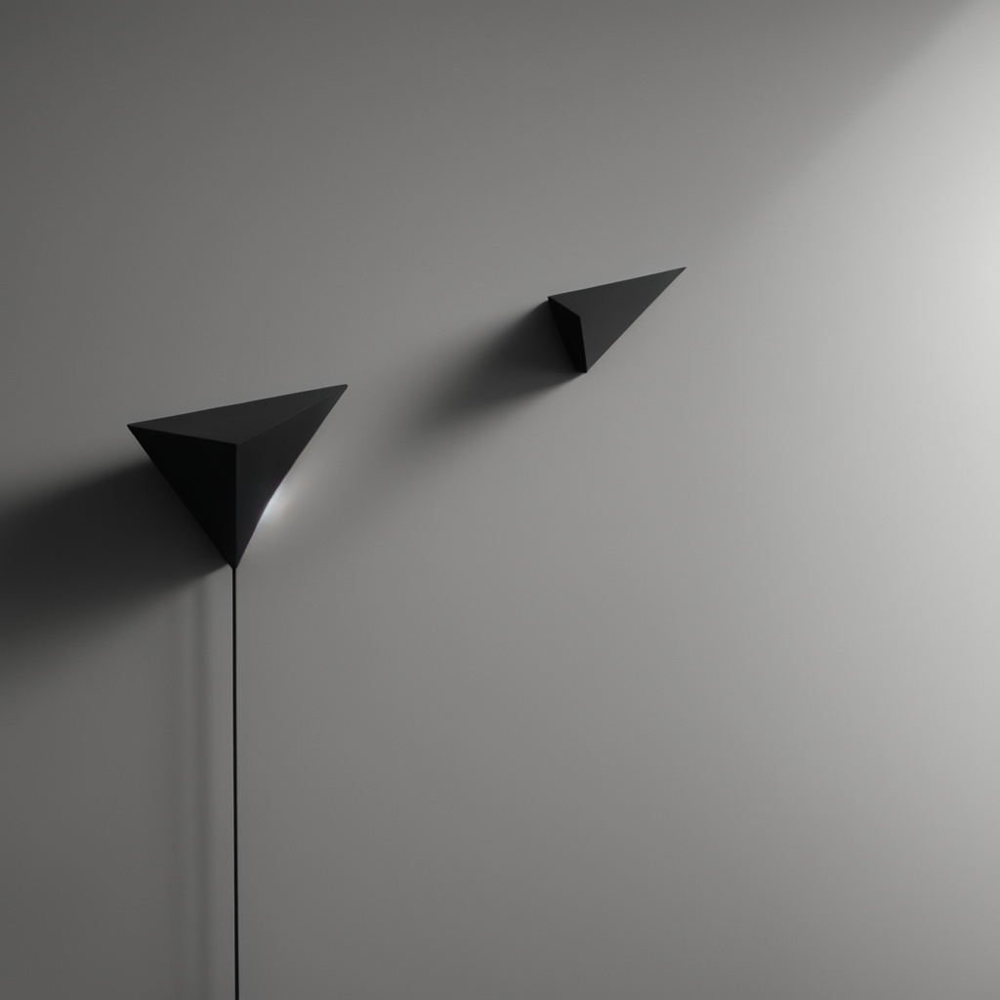
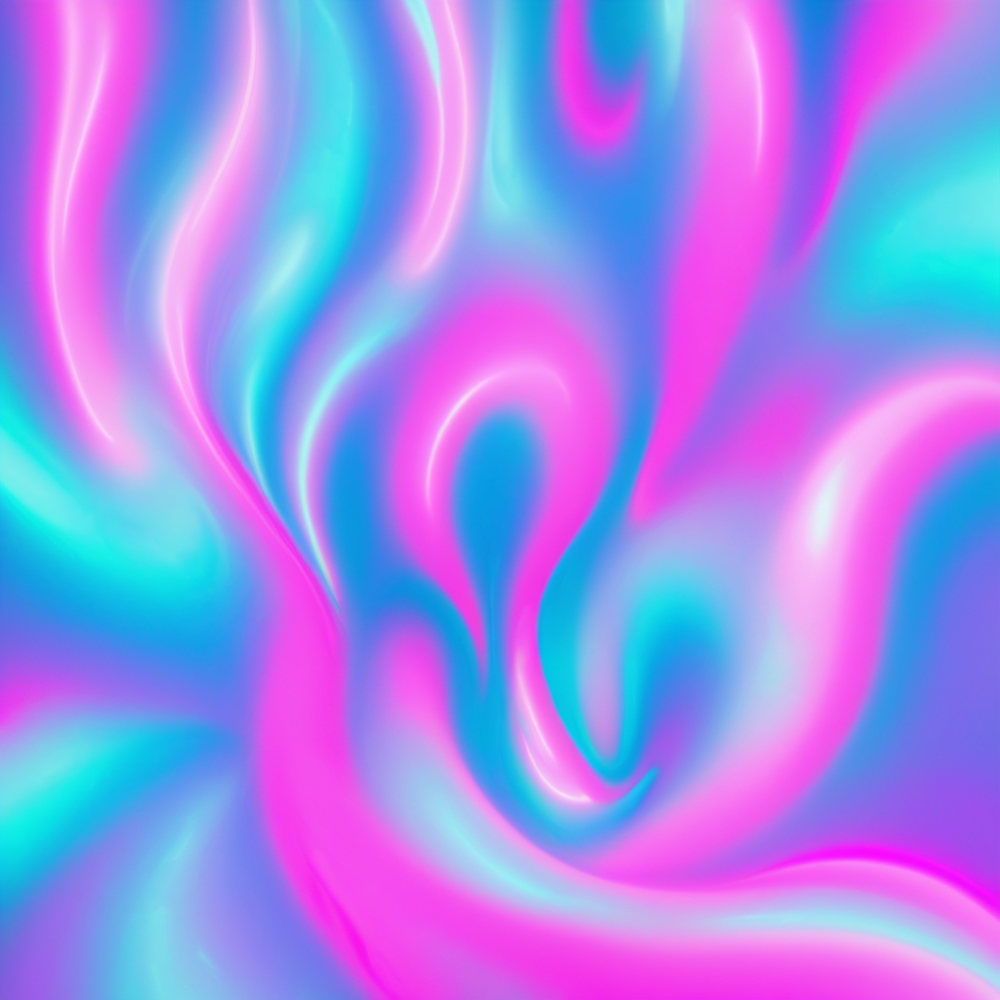
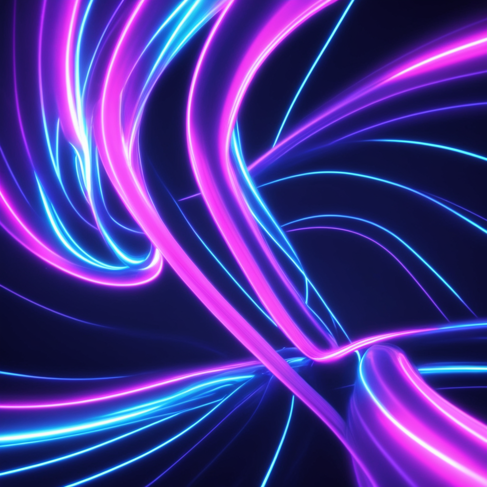

# Wallpaper Workflow Pack

**100% Local · 100% Private · 100% On Your Hardware**

A sovereign workflow for generating high-quality abstract wallpapers with free, offline tools. No cloud, no subscriptions, no data leaving your machine.

---

## Quick Start

```
Generate (1024²)  →  Upscale (4×)  →  Review  →  Export (4096²)  →  Use
   DiffusionBee          Upscayl
```

1. Install [DiffusionBee](https://diffusionbee.com/) and [Upscayl](https://upscayl.org/)
2. Copy a prompt from [Example Gallery](#example-gallery) or `PROMPTS.txt`
3. Generate at **1024 × 1024** (4 images per batch)
4. Upscale your pick with **High Fidelity · 4×** to reach **4096 × 4096**
5. Save finals to `EXPORTS/`

See `WORKFLOW.txt` for the full step-by-step guide. **Prefer pictures?** See **Workflow Visuals** below.

---

## What's Included

| File / Folder | Purpose |
|---------------|---------|
| `README.md` | Project overview (this file) |
| `WORKFLOW.txt` | Step-by-step instructions |
| `PROMPTS.txt` | Prompt library and variations |
| `TOOLS.txt` | Software reference and settings |
| `SAFETY.txt` | Ethics, privacy, and sovereign rules |
| `TROUBLESHOOTING.txt` | Fixes for common issues |
| `CREDITS.txt` | Tool attribution |
| `EXPORTS/` | Your final wallpaper outputs |
| `EXAMPLES/` | Reference images at each pipeline stage |

---

## Project Structure

```
wallpaper-workflow-pack/
├── README.md
├── WORKFLOW.txt
├── PROMPTS.txt
├── TOOLS.txt
├── SAFETY.txt
├── TROUBLESHOOTING.txt
├── CREDITS.txt
├── EXPORTS/
└── EXAMPLES/
    ├── DiffusionBee_Examples/       # Raw 1024 × 1024 generations
    │   ├── Cotton_Candy_Examples_DiffusionBee/
    │   ├── Matte_Black_Examples_DiffusionBee/
    │   ├── Vaporwave_Examples_DiffusionBee/
    │   └── Cyber_Ribbons_Example_DiffusionBee/
    └── Upscayl_Examples /            # Upscaled 4096 × 4096 finals
        ├── Cotton_Candy_Upscayl/
        ├── Matte_Black_Upscayl/
        ├── Vaporwave_Upscayl/
        └── Cyber_Ribbons_Upscayl/
```

---

## Workflow Visuals

Read top to bottom. Diagram 1 is the generation pipeline; Diagram 2 maps every file and folder in the pack.

### Wallpaper Workflow Pipeline



### Project Structure Overview



---

## Tools

### DiffusionBee — Generation

| Setting | Value |
|---------|-------|
| Model | Default Stable Diffusion (SD 1.5 / 2.1 / SDXL) |
| Resolution | 1024 × 1024 |
| Batch size | 4 |
| Seed | -1 (random) |
| Steps | 25 |
| Advanced Options | ON |
| Save | Right-click → Save (manual) |

### Upscayl — Upscaling

| Setting | Value |
|---------|-------|
| Model | High Fidelity (ESRGAN-based) |
| Scale | 4× |
| Output | Set `EXPORTS/` manually each session |
| Result | 4096 × 4096 (true 4K) |

### Alternatives

Any fully offline tool works. Substitute generators (InvokeAI, NMKD) or upscalers (chaiNNer, ESRGAN forks) without changing the workflow.

---

## Workflow

### 1. Generate

Open DiffusionBee, enable Advanced Options, and run a batch at 1024 × 1024. Always use both a positive and negative prompt. Review all four outputs and save your best pick.

> Pastel prompts need literal color language. If tones don't land, regenerate with specific palette words.

### 2. Upscale

Open Upscayl, confirm the output folder, select your image, and upscale at 4× with the High Fidelity model. Use the before/after slider to compare.

> A weak base image won't improve with upscaling. Reject early and regenerate.

### 3. Review

Zoom to full resolution. Check for grain, choppy edges, artifacts, and palette drift. Test on phone, laptop, and desktop before calling anything final.

### 4. Export

Save approved wallpapers to `EXPORTS/`. Name by theme (e.g. `cotton_candy_swirl_01.png`).

### 5. Share (optional)

| Platform | Size |
|----------|------|
| Instagram | 1080 × 1350 or 1080 × 1080 |
| Discord | Under 8 MB |
| Twitter/X | 2000 px max |

For social copies: resize to 2048 × 2048, convert to JPG at 90–95% quality, and avoid over-compressing pastel gradients.

---

## Upscaling Process

```
1024 × 1024  ──4×──►  4096 × 4096
 DiffusionBee          Upscayl
```

**Quality rules**

- Reject soft or muddy bases before upscaling
- Pastel images upscale better than very dark ones
- If the slider shows worse output than input, regenerate
- Set the Upscayl output folder manually every session

Each theme in `EXAMPLES/` includes paired before (1024) and after (4096) folders.

---

## Prompt Library

### Base Prompt

```
High-resolution abstract wallpaper with smooth gradients, clean lighting,
soft texture detail, and a modern aesthetic. Balanced composition, no text,
no logos, no artifacts. Crisp edges, subtle depth, and visually pleasing
color harmony.
```

### Themed Variations

| Theme | Prompt snippet |
|-------|----------------|
| Cotton Candy | `cotton candy abstract swirl, soft neon pastels, glossy highlights` |
| Matte Black | `matte black geometric shapes with subtle rim-light` |
| Vaporwave | `vaporwave gradient clouds with dreamy lighting` |
| Cyber Ribbons | `cyber-aesthetic neon ribbons with reflective surfaces` |
| Minimal Fields | `minimalist color fields with soft diffusion and gentle noise texture` |

### Always Include

`high-resolution` · `smooth gradients` · `clean lighting` · `wallpaper-ready` · `balanced composition`

### Always Avoid

`text` · `watermark` · `faces` · `people` · `clutter` · `artifacts` · `distortion`

### Tips

| Issue | Fix |
|-------|-----|
| Pastels blow out | Reduce contrast; use literal palette names |
| Matte black blobs | Add `soft lighting` or `subtle rim-light` |
| Neon too bright | Use `subtle glow` instead of intense glow |
| Hallucinations | Simplify prompt; add `no extra elements` |

Full prompts for every theme are in `PROMPTS.txt` and each `EXAMPLES/` subfolder.

---

## Example Gallery

Four collections with prompts, raw generations, and upscaled finals.

### Cotton Candy Swirl

<p align="center">
  
  &nbsp;→&nbsp;
  
</p>

<details>
<summary>Prompts</summary>

**Positive:** Abstract fluid art, ethereal swirls of cotton candy pink, dreamlike baby blue, and soft lavender, hyper-detailed silky textures, glowing ambient lighting, dreamcore aesthetic, volumetric vapor, octane render, 8k resolution, cinematic composition, soft bokeh background, flowing organic shapes.

**Negative:** sharp edges, geometric shapes, text, watermark, signature, messy, noisy, dark colors, gritty, low resolution, distorted, grainy, pixelated, photographic realism, blocky

</details>

### Matte Black Minimal

<p align="center">
  
  &nbsp;→&nbsp;
  
</p>

<details>
<summary>Prompts</summary>

**Positive:** Minimalist abstract art, deep matte-black surfaces with subtle texture, soft diffused lighting, smooth geometric curves, premium tech aesthetic, ultra-clean composition, faint rim-light highlights, subtle depth gradients, high-contrast shadows, 8k resolution, cinematic lighting, modern industrial design, elegant simplicity, refined micro-detail, dark monochrome palette.

**Negative:** text, watermark, signature, faces, characters, objects, clutter, bright colors, neon, glossy reflections, noisy texture, grain, low resolution, pixelation, chaotic shapes, harsh lighting, overexposed highlights, busy patterns, photographic realism, glitch artifacts, distorted forms.

</details>

### Vaporwave Atmosphere

<p align="center">
  
  &nbsp;→&nbsp;
  
</p>

<details>
<summary>Prompts</summary>

**Positive:** vaporwave neon abstract atmosphere, soft glowing gradients, electric pink and cyan haze, retro-future color diffusion, dreamy synthwave ambience, smooth chromatic bloom, abstract light fields with no objects, premium vaporwave aesthetic, subtle holographic glow, flowing neon ambience, high-end retro art vibe, pure atmospheric abstraction without scenes or symbols.

**Negative:** palm trees, sunsets, sun, horizon lines, grids, wireframes, buildings, cityscapes, cars, characters, faces, anime, silhouettes, text, letters, numbers, logos, symbols, UI elements, HUD elements, objects, patterns, circuitry, noise, grain, banding, artifacts, vignetting, harsh contrast, realistic lighting, landscapes, scenery.

</details>

### Cyber Ribbons

<p align="center">
  
  &nbsp;→&nbsp;
  
</p>

<details>
<summary>Prompts</summary>

**Positive:** Futuristic abstract art, flowing neon cyber ribbons twisting through dark space, smooth reflective surfaces, electric blue and magenta light trails, soft volumetric glow, high-contrast digital aesthetic, silky curvature, ultra-clean edges, 8k resolution, octane render style, cinematic lighting, dynamic motion energy, elegant sweeping arcs, deep black background.

**Negative:** text, watermark, signature, faces, characters, objects, clutter, messy composition, jagged edges, grainy, noisy, low resolution, pixelated, distorted shapes, chaotic patterns, harsh shadows, muddy colors, photographic realism, glitch artifacts, blocky, geometric hard shapes.

</details>

---

## Reproduce These Results

1. Install DiffusionBee and Upscayl
2. Open the theme's prompt file in `EXAMPLES/DiffusionBee_Examples/<theme>/`
3. Paste positive and negative prompts into DiffusionBee
4. Generate at 1024 × 1024, batch of 4, seed -1, 25 steps
5. Save your pick (right-click → Save)
6. Upscale in Upscayl: High Fidelity, 4×, output to `EXPORTS/`
7. Compare against the matching `EXAMPLES/` before/after images

---

## Troubleshooting

| Symptom | Fix |
|---------|-----|
| Soft or blurry output | Regenerate; add `clean composition`; don't upscale weak bases |
| Washed-out colors | Add `high color depth`; be literal with palette names |
| Artifacts or hallucinations | Simplify prompt; add `no extra elements`; reject early |
| Upscaler adds noise | Try another mode; reject if slider shows worse output |
| Pastels missing | Use literal color names; reduce contrast |
| Matte black blobs | Add `soft lighting` or `subtle rim-light` |
| Neon too bright | Use `subtle glow` |
| VRAM errors | Close other apps; reduce batch size; restart app |
| Wrong save folder | Set Upscayl output manually every session |
| File too large | Export 2048² JPG copy at 90–95% quality |

See `TROUBLESHOOTING.txt` for the complete guide.

---

## Safety & Ethics

- All work stays local — no cloud, uploads, or telemetry
- Abstract and non-human content only
- No real faces, likenesses, or copyrighted IP
- No personal data in prompts
- Monitor hardware temps during long sessions

See `SAFETY.txt` for full guardrails.

---

## Credits

| Tool | Role |
|------|------|
| [DiffusionBee](https://diffusionbee.com/) | Image generation |
| [Upscayl](https://upscayl.org/) | 4× upscaling |
| Stable Diffusion | Default generation model |
| High Fidelity / ESRGAN | Default upscale model |

All trademarks belong to their respective owners. This pack is not affiliated with or endorsed by any external tools. Software must be downloaded separately.

All example wallpapers were generated and upscaled entirely on local hardware.

---

## Requirements

- Modern CPU/GPU with sufficient VRAM
- Disk space for batches and 4K exports
- macOS, Windows, or Linux
- DiffusionBee and Upscayl (free, installed separately)

---

## Who This Is For

Creators who want wallpaper-ready abstract art, clean aesthetic assets, and a local-first workflow that respects privacy — whether you're starting out or already running a private generation pipeline.
